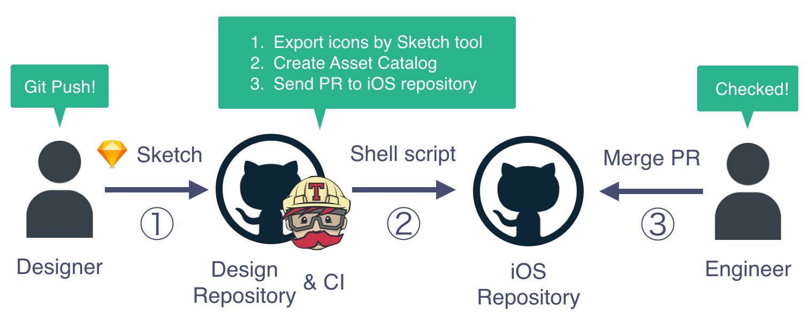

# sketch-export-sample [](https://travis-ci.org/konifar/sketch-export-sample)
This exports the icons in Sketch files to Android/iOS projects.

# Overview
- Easy to manage both Android and iOS icons.
- All the engineer needs to do are only checking Pull Request which is created by CI.
- Good bye human error.



## 1. Push Sketch file to GitHub
- When the designer add or modify the icons, s/he pushes [Sketch file](https://github.com/konifar/sketch-export-sample/blob/master/images.sketch) to GitHubRepository.
- Sketch file has the images and icons which are used in Android/iOS app.
- Basically the icons' color is white. Simple icons are tinted programmatically.
- There is simple naming rule to export the image files automatically.

Type | Rule | Example
:--: | :--: | :--:
Image | img_{name} | img_quiz_result, img_tutorial_1
Icon | ic_{name}_{size} | ic_quiz_24, ic_star_48

- If the designer is not familiar with Git, [git-sketch-plugin](https://github.com/mathieudutour/git-sketch-plugin) might help. This tool provides `Git` menu and we can commit and push on Sketch. Plus, it generates the preview image file per Art board. We can check the image diff on Pull Request.

## 2. Export icons by Sketch tool
- On CI, Sketch tool is installed in [install_sketch.sh](https://github.com/konifar/sketch-export-sample/blob/master/scripts/install_sketch.sh)
- [sketch tool](https://www.sketchapp.com/tool/) provides some command line tool for Sketch.
- The icons in `images.sketch` is exported in [export-images.sh](https://github.com/konifar/sketch-export-sample/blob/master/scripts/export_images.sh)

```shell
% sketchtool export slices images.sketch --output=out/images
Exported ic_todo_schedule_24.png
Exported ic_todo_schedule_24@1.5x.png
Exported ic_todo_schedule_24@2x.png
Exported ic_todo_schedule_24@3x.png
…
```

## 3. Apply images to iOS/Android project.
### iOS
- [import_to_ios.sh](https://github.com/konifar/sketch-export-sample/blob/master/scripts/import_to_ios.sh) creates Asset catalog.
- Sketch tool supports to export the pdf file too. (But this repository doesn't support. Welcome your contribution!)
- Actually, the structure of Asset catalog is so simple.

#### File structure
```shell
Assets.xcassets
├ ic_shopping_cart_24.imageset
  ├ Contents.json
  ├ ic_shopping_cart_24.png
  ├ ic_shopping_cart_24@2x.png
  ├ ic_shopping_cart_24@3x.png
```

#### Contents.json
```json
{
  "images" : [
    {
      "idiom" : "universal",
      "filename" : "ic_shopping_cart_24.png",
      "scale" : "1x"
    },
    {
      "idiom" : "universal",
      "filename" : "ic_shopping_cart_24@2x.png",
      "scale" : "2x"
    },
    {
      "idiom" : "universal",
      "filename" : "ic_shopping_cart_24@3x.png",
      "scale" : "3x"
    }
  ],
  "info" : {
    "version" : 1,
    "author" : "xcode"
  }
}
```

### Android
Will update soon.

## 4. Send Pull Request to iOS/Android repository.
- Pull Request are send automatically if it's changed. See https://github.com/konifar/sketch-export-sample/pull/6
- Only Engineers have to do is to check and merge the Pull Request!
